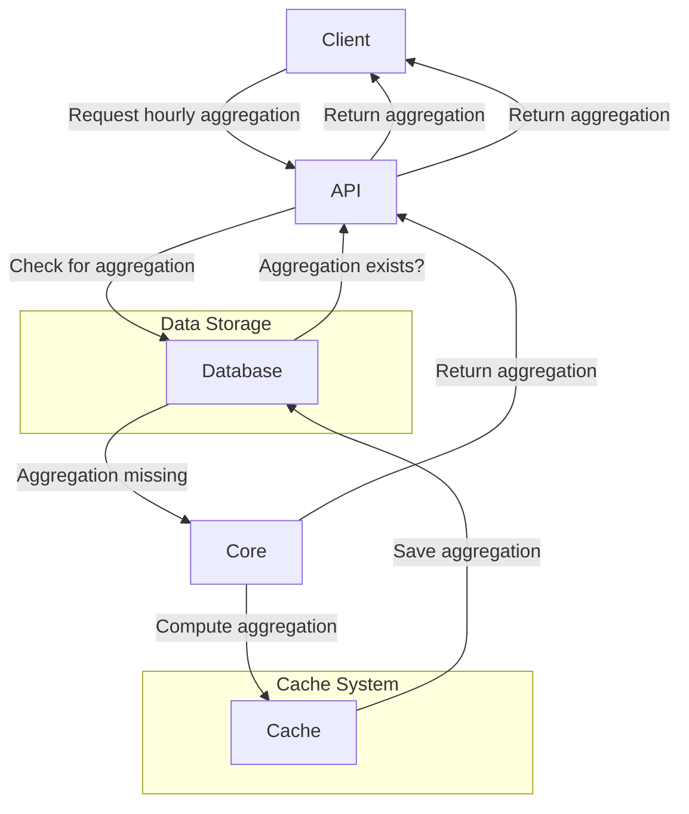

# Times Series Aggregator

## Overview

Times Series Aggregator is a modular project designed to efficiently serve, compute, cache, and store timeseries data and their aggregations.

## Architecture

Below is a high-level architecture diagram in Mermaid:

- **API**: Handles client requests for timeseries and aggregations.
- **Database**: Stores raw data and computed aggregations.
- **Core**: Computes aggregations when not available in the database.
- **Cache**: Acts as an API on the database, saving computed aggregations and optimizing resource usage.

## Interaction Flow Example

1. A client requests hourly aggregations of raw data via the API.
2. The API checks the database for precomputed aggregations.
3. If the aggregation exists, it is returned to the client.
4. If not, the API asks the core to compute the aggregation.
5. The core computes the aggregation and saves the result in the cache (which interfaces with the database).
6. The aggregation is then returned to the client.

## Cache Strategy

The cache system is crucial for performance:
- Aggregations can be compute-intensive.
- To save resources, data near the current timestamp is refreshed more frequently.
- Data further in the past is recomputed less often, relying on cached results.

This strategy ensures efficient use of resources while providing up-to-date results for recent data and fast access to historical aggregations.

## Project Structure

- `api/` - Service code for timeseries and aggregations
- `core/` - Aggregation computation logic
- `cache/` - Caching layer implementation
- `database/` - Database schema and models

## Getting Started

Instructions for setup and usage will be added as the project evolves.
